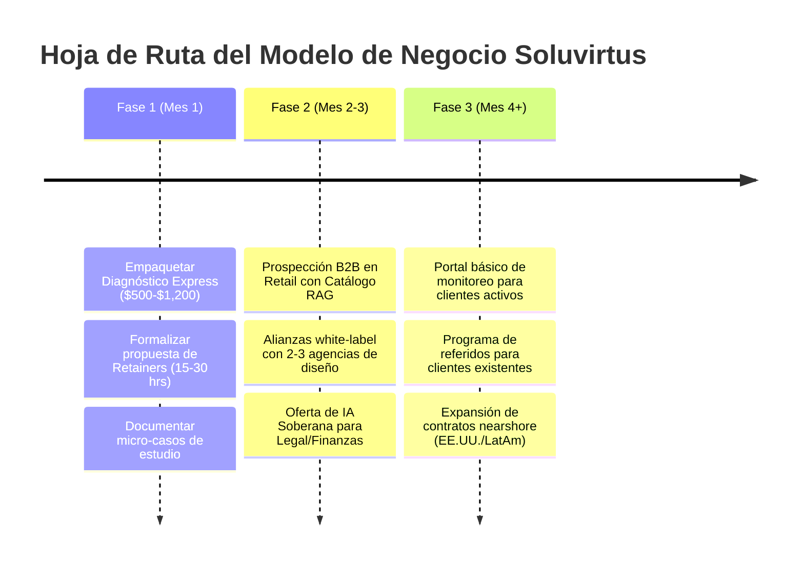

# Diagnóstico Estratégico y Priorización del Modelo de Negocio — Soluvirtus

Este documento analiza, clasifica y prioriza las **30 sugerencias del modelo de negocio** recopiladas en el proyecto, alineándolas con la trayectoria técnica corporativa del fundador (**BBVA, Warner Bros. Discovery y JK Tornel**) para maximizar el margen de ganancia, la predictibilidad de ingresos (MRR) y el posicionamiento de ingeniería de alto estándar.

---

## 1. Criterios de Evaluación Estratégica

Para evitar diluir la autoridad de la consultora, cada sugerencia se evalúa bajo cuatro filtros:
1. **Apalancamiento de Autoridad E-E-A-T:** ¿Refleja estándares de ingeniería corporativa bancaria e industrial o parece una agencia genérica de marketing?
2. **Generación de Flujo Recurrente (MRR):** ¿Crea contratos de retención y mantenimiento predecibles o depende de proyectos únicos de cobro aislado?
3. **Fricción de Cierre Comercial:** ¿Facilita la entrada de nuevos clientes reduciendo el riesgo percibido?
4. **Viabilidad Operativa y Soporte:** ¿Es escalable sin generar disputas contractuales o cargas técnicas insostenibles?

---

## 2. Clasificación y Matriz de Prioridades

```mermaid
quadrantChart
    title Matriz de Impacto vs. Esfuerzo de Implementación
    x-axis Menor Esfuerzo --> Mayor Esfuerzo
    y-axis Menor Impacto --> Mayor Impacto
    quadrant-1 Victorias Inmediatas (P1)
    quadrant-2 Iniciativas de Escala (P2)
    quadrant-3 Descartadas / Riesgo Reputacional
    quadrant-4 Iniciativas Secundarias
    "Auditorías Técnicas (Foot-in-the-Door)": [0.25, 0.88]
    "Retainers de Mantenimiento de IA": [0.40, 0.92]
    "Consultoría Soberanía & Privacidad": [0.35, 0.85]
    "Solución Retail & Catálogos RAG": [0.55, 0.82]
    "Real Estate High-End Scrapers": [0.45, 0.78]
    "Partnerships con Agencias Creativas": [0.30, 0.75]
    "Portal de Clientes": [0.75, 0.65]
    "Certificación Sello Soluvirtus": [0.60, 0.40]
    "Smartphones/Termux en Empresas": [0.80, 0.20]
    "RevShare 1-3% en Ventas": [0.85, 0.30]
    "Garantías de 5 min (Infoproducto)": [0.20, 0.15]
```

---

## 3. Grupo 1: Victorias Inmediatas de Alto Valor (Prioridad 1)

Iniciativas que deben liderar la estrategia comercial de corto plazo por su bajo costo de adquisición y alto retorno:

### A. Auditorías de Automatización & Diagnóstico Técnico (Sugerencia 3)
- **Concepto:** Servicio de entrada (*foot-in-the-door*) de bajo riesgo. En lugar de exigir $5,000–$15,000 USD por adelantado a un prospecto escéptico, se ofrece una evaluación técnica profunda por **$500 – $1,200 USD**.
- **Entregable:** Informe ejecutivo con análisis de cuellos de botella, arquitectura de agentes propuesta, stack recomendado y cálculo exacto de retorno de inversión (ROI).
- **Incentivo de cierre:** Si el cliente aprueba la implementación completa dentro de los primeros 30 días, el monto del diagnóstico se bonifica al costo total del proyecto.

### B. Retainers Mensuales & Bolsas de Horas de Ingeniería (Sugerencias 4 y 21)
- **Concepto:** Transformar proyectos únicos en ingresos recurrentes predecibles (**$800 – $2,500 USD/mes**).
- **Justificación técnica:** Los agentes, scrapers y modelos locales requieren mantenimiento preventivo:
  - Adaptación ante cambios de marcado HTML/DOM en fuentes externas.
  - Actualización periódica de pesos de modelos locales (Llama, Mistral, Qwen).
  - Monitoreo de latencia, seguridad de sockets y rotación de certificados SSL/TLS.
- **Formato:** Paquetes de 10, 20 o 40 horas mensuales con respuesta técnica prioritaria categorizada (SLA < 4 horas).

### C. Consultoría de Soberanía de Datos y Cumplimiento Normativo (Sugerencias 12 y 30)
- **Apalancamiento:** Basado en el caso de éxito de **JK Tornel (GINTOR)** con estándares **C-TPAT / NEEC** y el rigor transaccional de **BBVA**.
- **Audiencia:** Direcciones Financieras, Legales y CTOs de empresas medianas/grandes que tienen prohibido contractualmente enviar registros confidenciales a APIs públicas (OpenAI, Google).
- **Propuesta:** Auditoría de flujo de datos y despliegue de inferencia local en hardware dedicado con costo marginal de $0.00/token y cero fugas de propiedad intelectual.

---

## 4. Grupo 2: Segmentación de Nichos & Expansión B2B (Prioridad 2)

Especializaciones de vertical que capitalizan la infraestructura ya desarrollada en Soluvirtus:

| Nicho | Sugerencia | Stack Tecnológico | Propuesta de Valor Cuantitativa |
| :--- | :---: | :--- | :--- |
| **Retail & Catálogos Masivos** | #8 | `PyMuPDF` + `pgvector` / `LanceDB` + `Next.js` | Ingesta de +2,000 fichas técnicas en PDF. Reducción del tiempo de búsqueda y cotización de **12 min a <45 seg (-85%)**. |
| **Real Estate High-End** | #7 | `Python` + `Selenium` + `Pytest` + `Webhooks` | Scraper multicanal con scoring algorítmico. Generación de **+350 leads calificados/mes** y ahorro de 18 horas semanales. |
| **Agencias Creativas / Diseño** | #25 | `Astro` + `Next.js` + `Supabase RLS` | Brazo técnico *white-label* nearshore para agencias que venden branding pero carecen de desarrolladores sénior. |
| **Talleres Médicos / IPS** | #9 | Hardware local + `Ollama` + SQLite/Postgres | Agendamiento y análisis de historiales locales con estricta privacidad de datos de pacientes (cumplimiento normativo de salud). |

---

## 5. Grupo 3: Iniciativas a Descartar o Replantear (Protección de Marca)

Para mantener una imagen de consultoría enterprise de alto nivel, se descartan o transforman las siguientes sugerencias:

| Sugerencia Original | Riesgo Detectado | Decisión Estratégica | Alternativa Enterprise Recomendada |
| :--- | :--- | :---: | :--- |
| **#11: Ecosistema Móvil PyMEs** (Servidores en celulares reciclados con Termux) | Riesgo de sobrecalentamiento, fallas de hardware y percepción "amateur" ante directivos corporativos. | **Descartar para clientes B2B** | Reservar como proyecto open-source/demostración personal. Para clientes, ofrecer mini-servidores dedicados x86 (NUC/mini PC) o instancias OCI privadas. |
| **#2: RevShare 1% a 3% en Ventas** | Alta fricción contable, desconfianza en auditorías de ventas y riesgo de impago sin control del checkout. | **Descartar** | Tarifa fija de ingeniería por proyecto + Retainer mensual por optimización y soporte continuo. |
| **#14: Garantía de Reembolso en 5 min** | Típico de infoproductos o agencias de marketing agresivo; resta seriedad ante comités técnicos. | **Descartar** | Acuerdos formales de nivel de servicio (**SLA**) con disponibilidad garantizada de 99.5% y pruebas automatizadas E2E. |
| **#24: Clústeres de Raspberry Pi** | Inestabilidad en tarjetas SD y cuello de botella de I/O en bases de datos pesadas. | **Replantear** | Servidores locales tipo Workstation (GPU RTX/Mac Studio) o hardware en rack según volumen de tokens. |

---

## 6. Hoja de Ruta de Ejecución Comercial



---

## 7. Resumen de Estado de las 30 Sugerencias

- **Prioridad 1 (Adopción Inmediata):** Sugerencias 3, 4, 5, 8, 12, 21, 26 y 30.
- **Prioridad 2 (Expansión y Nichos):** Sugerencias 1, 6, 7, 9, 10, 13, 15, 18, 20, 22, 23, 25 y 28.
- **Prioridad 3 (Escalamiento Posterior):** Sugerencias 16, 17, 19, 27 y 29.
- **Descartadas / Readecuadas (Riesgo Reputacional):** Sugerencias 2, 11, 14 y 24.
